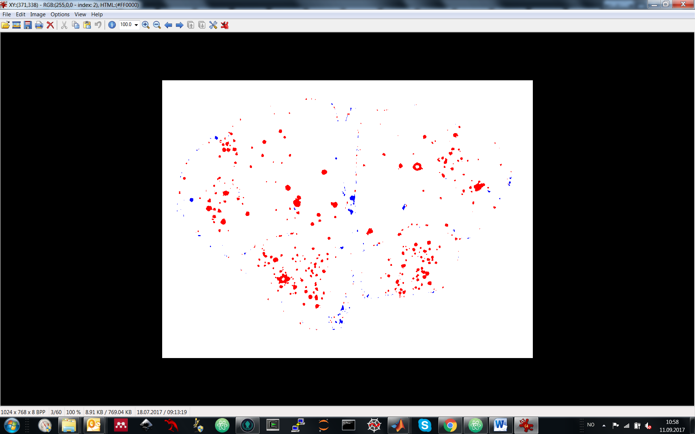

# Combining segmentations and spatial information
Repository gathering Matlab scripts combining section segmentations from [Ilastik](www.ilastik.org) software and spatial information (atlas regions) obtained after anchoring using QuickNII.

The main objective is to provide regional information about the objects (single cells, plaques, etc...) extracted from the microscopy sections.

Any request about these scripts should be directed to christopher dot coello at gmail dot com.

## General description of the workflow
The workflow can be decomposed in two or three major steps.

The first step (`quantify_dataset.m`) is to generate a list of all the individual objects together with the region they belong to. The second step (`combine_obj_seg.m`) is to combine these individual objects to obtain regional information. The third step (optional, `combine_hierarchy.m`) is to gather regions following a hierarchy to generate results at a coarse regional level.

## Usage
**Step 1:** generate list of individual objects and its associated regions
```matlabsession
>> output_json_file = quantify_dataset('C:\data\test\cs\study_info.json');
```
**Step 2:** combine these individual objects to obtain regional information
```matlabsession
>> stats_json_file = combine_obj_reg(output_json_file);
```
**Step 3** hierarchy
```matlabsession
>> combine_hierarchy(stats_json_fn,'C:\data\test\cs\study_info.json')
```


## Inputs
The input is formatted as a JSON file. This file will be given as input of the function `quantify_dataset`. Remember that Windows path have to be entered with double backslashes (`\\`) and not simple backslashes (`\`)

```json
{
  "study_name": "crossseeds_m287",
  "atlas_dir": "C:\\data\\cs\\6_reslicedAtlasTemplate\\",
  "atlas_lbl_file": "C:\\data\\cs\\6_reslicedAtlasTemplate\\annotation.label",
  "atlas_xml_file": "C:\\data\\cs\\6_reslicedAtlasTemplate\\coord.xml",
  "seg_dir": "C:\\data\\cs\\7_segmentationilastik\\",
  "obj_lbl": 2,
  "slice_dir": "C:\\data\\cs\\5_downsampledQuickNii\\",
  "output_dir": "C:\\data\\cs\\8_output",
  "hier_dir": "C:\\data\\cs\\7_segmentationilastik\\regions\\"
}
```

* **"study_name"** the name of the study that will be used to name the output JSON files.

* **"atlas_dir"** the path to the customised atlas sections generated by Gergely that contains for each section
  * a custom MRI cut (png)
  * a custom Atlas cut (png)
  * a custom Atlas cut (bin)
  * (if mouse) a custom Atlas cut with Nissl stain (png)

* **"atlas_lbl_file"** the path to the file that contains the list of annotations from the reference atlas (ITKSnap label file). This file is used to get the correspondence between image label and region name
* **"atlas_xml_file"** the path to the file that contains the spatial coordiantes of the serie. This file is generated by the QuickNII software
* **"seg_dir"** the path to the folder containing the segmentation images obtained after Ilastik process
* **"obj_lbl"** the label (integer) that encodes the object of interest in the output segmentation image.In the example below, the object of interest (red) is indexed with 2 (see top frame of the window: RGB(255,0,0 - index: 2))


* **"slice_dir"**  a folder containing the downsmapled image files (png). It is important to use the images that have been used for the anchoring using QuickNII.
* **"output_dir"** the path to the folder where the output json files and the overlay images are stored

* **"hier_dir"** (optional) if ones want to gather regions following a hierarchy, the path to the folder containing the Excel files of the different hierarchies should be entered in this field
* **"original_dir"** : if the txt file containing the spatial information is not present in the **"slice_dir"** folder, the program will look for spatial metadata (resolution, width and height) in the tiff file ready for Navigator. 

## Important
The segmentation folder **"seg_dir"** defines the sections to be analysed. The filename in **"seg_dir"** defines the name of the sections (excluding \_Object Predictions). The resolution and original image size are harvested from the text file in **"slice_dir"**  generated by the export script from Zen.

Example:

**"seg_dir"**   -> ``tg2576_m287_1D1_s010_Object Predictions.png``

**"atlas_dir"** -> ``761_3165_4247_tg2576_m287_1D1_s010_Segmentation.bin``

**"slice_dir"** -> ``tg2576_m287_1D1_s010.png`` and ``tg2576_m287_1D1_s010.txt``

## Requirements
* Matlab (2015b or more recent)
* [JSONlab](se.mathworks.com/matlabcentral/fileexchange/33381-jsonlab--a-toolbox-to-encode-decode-json-files "Exist also as Matlab App") a Matlab toolobox to read/write JSON files
