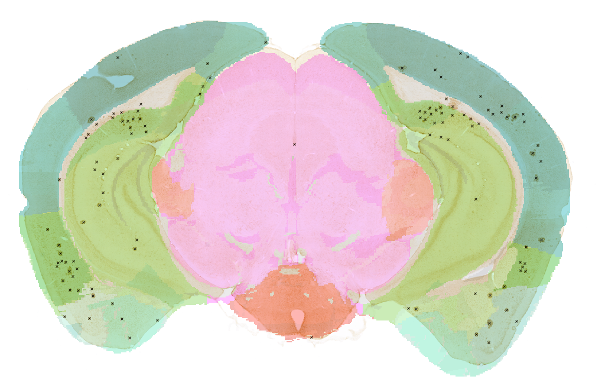
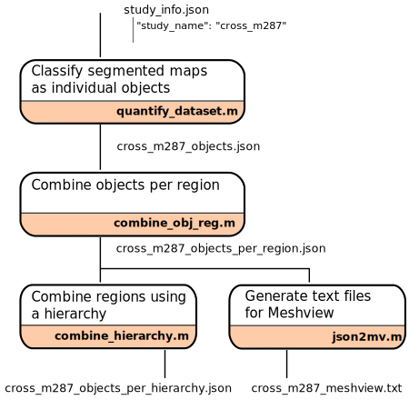

# Combining segmentations and spatial information
Repository gathering Matlab scripts combining segmentation maps from [Ilastik](www.ilastik.org) software and spatial information (atlas regions) obtained after anchoring using QuickNII.

The main objective is to provide regional information about the objects (single cells, plaques, etc...) extracted from the microscopy sections.

Any request about these scripts should be directed to christopher dot coello at gmail dot com.

***Important: these scripts have been developped for the Allen Mouse Brain Atlas at 25 \(\mu m\) resoution. Even if extending the script to other atlases might be trivial, no test have been made with rat or human atlases. In addition, real world spatial coordinates will be incorrect when changing atlas (because of orientation standards)***

## General description of the workflow
The workflow can be decomposed in four steps, described in the workflow.



The first step (`quantify_dataset.m`) is to generate a list of all the individual objects together with the region they belong to. The second step (`combine_obj_seg.m`) is to combine these individual objects to obtain regional information. The third step (optional, `combine_hierarchy.m`) is to gather regions following a hierarchy to generate results at a coarse regional level.

## Usage
**Classify segmented maps as individual objects** : generate list of individual objects and its associated regions
```matlabsession
>> study_info_fn = 'C:\data\test\cs\study_info.json';
>> study_objects = quantify_dataset(study_info_fn);
```
**Combine objects per region** : combine these individual objects to obtain regional information
```matlabsession
>> study_objects_region = combine_obj_reg(study_objects);
```
**Combine regions using a hierarchy** : combine regions following a user defined hierarchy
```matlabsession
>> combine_hierarchy(study_objects_region,study_info_fn);
```
**Generate text files for Meshview** : list the atlas centroid coordinates of the individual objects in a Meshview friendly way
```matlabsession
>> json2mv(study_objects_region);
```

## Inputs
The input is formatted as a JSON file. This JSON file is referred as `study_info.json` in this document. This file will be given as input of the function `quantify_dataset`. Remember that Windows path have to be entered with double backslashes (`\\`) and not simple backslashes (`\`). The last entry line does not finish with a comma (`,`).

```json
{
  "study_name": "crossseeds_m287",
  "slice_dir": "C:\\data\\cs\\5_downsampledQuickNii\\",
  "atlas_dir": "C:\\data\\cs\\6_reslicedAtlasTemplate\\",
  "atlas_lbl_file": "C:\\data\\cs\\6_reslicedAtlasTemplate\\annotation.label",
  "seg_dir": "C:\\data\\cs\\7_segmentationilastik\\",
  "obj_lbl": 2,
  "output_dir": "C:\\data\\cs\\8_output",
  "hier_dir": "C:\\data\\cs\\7_segmentationilastik\\regions\\"
}
```
### Required inputs

* **"study_name"** the name of the study that will be used to name the output JSON files.

* **"slice_dir"**  a folder containing the downsmapled image files (png). It is important to use the images that have been used for the anchoring using QuickNII.

* **"atlas_dir"** the path to the customised atlas sections generated by Gergely that contains for each section
  * a custom MRI cut (png)
  * a custom Atlas cut (png)
  * a custom Atlas cut (bin)
  * (if mouse) a custom Atlas cut with Nissl stain (png)

* **"atlas_lbl_file"** the path to the file that contains the list of annotations from the reference atlas (ITKSnap label file). This file is used to get the correspondence between image label and region name

* **"seg_dir"** the path to the folder containing the segmentation images obtained after Ilastik process

* **"obj_lbl"** the label (integer) that encodes the object of interest in the output segmentation image.In the example below, the object of interest (red) is indexed with 2 (see top frame of the window: RGB(255,0,0 - index: 2), software used for visualising images: [IrfanView](www.irfanview.com))


* **"output_dir"** the path to the folder where the output json files and the overlay images are stored

### Optional Inputs

* **"hier_dir"** if ones want to gather regions following a hierarchy, the path to the folder containing the Excel files of the different hierarchies should be entered in this field

* **"atlas_xml_file"** the path to the file that contains the spatial coordiantes of the serie. This file is generated by the QuickNII software

* **"original_dir"** location of the tiff files with original dimensions. This folder might also contain the txt file containing the spatial metadata (resolution, width and height).

* **"allen_json"** location of the JSON file containing the information of the whole dataset as generated per Allen Institute.

* **"pixel_dim"** pixel edge dimension in micrometers of the pixel in the images in **"seg_dir"**

## Outputs

The output files will be written in the **"output_dir"** folder. The structure of the output folder is as follows :
* output_dir
  * study_name_objects.json : **List of individual objects**
  * study_name_objects_per_region.json : **List of objects features per region**
  * study_name_objects_per_hierarchy.json : **List of objects features per hierarchy**
  * study_name_meshview.txt : **Meshview output per region**
  * excel/  : folder containing the Excel versions of the JSON files
  * qc_fig/ : folder containing the figures/images created during the classification procedure
  * sp_query/ : folder containing a cleaned version of the list of individual objects for spatial query purposes (work with Darius, EPFL)
  * meshview_ind_reg/ : folder containing the individual txt files per region for Meshview


**List of individual objects** a list of individual objects and its associated regions as a JSON file. The name of the file is composed of "study_name" followed by *\_objects.json* and is located in "output_dir". Each object have the following fields:

```json
{
  "date_analysis": "05-Oct-2017 13:35:39",
  "system_info": {
    "username": "sebastcc",
    "platformUsed": "PCWIN64",
    "osType": "Microsoft Windows 7 Enterprise ",
    "matlabVersion": "9.1.0.441655 (R2016b)"
  },
  "objects": [],
  "regions": []
}
```
with ``` "objects" ``` being composed of a list of objects identified in the stack of 2D images, eahc object containg the following properties
```json
"objects":[{
  "object_pixel": 43,
  "object_area": 1350.876163,
  "object_area_units": "umxum",
  "object_centroid_pixel": [77.74418605,271.4651163],
  "object_centroid_atlas": [343.4134343,410.0246331,188.8173445],
  "object_centroid_atlas_units": "ABA voxel 25um",
  "object_ori": 61.60663027,
  "object_major_al_pixel": 8.349427155,
  "object_minor_al_pixel": 6.701527156,
  "object_meanR": 207.9534884,
  "object_meanG": 174,
  "object_meanB": 111.0930233,
  "region_lbl": 943,
  "region_name": "Primary motor area, Layer 2\/3",
  "region_rgb": [31,157,90],
  "slice_name": "tg2576_m287_1D1_s002_Object Predictions",
  "slice_size": [685,1024]
}
]
```
and with ``` "regions" ``` being composed of a list of regions identified in the stack of 2D images, each region containg the following properties
```json
"regions":[
  {
    "name": "Secondary motor area, layer 1",
    "idx": 656,
    "clr": [31,157,90],
    "pixel": 10673,
    "area": 335300.03,
    "area_units": "umxum"
  }
]
```

**List of objects features per region** : a file (JSON, "study_name" followed by *\_objects_per_region.json*) that lists, per region, the number of objects detected (```"obj_cnt"```), the atlas coordinate of the centroid of each object (```"obj_coord"```), the total number of pixel covered by the objects (object load, ```"obj_pxl"```), the area in real world units (```"obj_area"```).
Example:

```json
[
  {
    "reg_name": "Agranular insular area, dorsal part, layer 1",
    "reg_idx": 996,
    "reg_pxl": 10304,
    "reg_area": 341080.0941,
    "reg_area_unit": "umxum",
    "obj_cnt": 6,
    "obj_reg_cnt_ratio": 1.75911761e-05,
    "obj_pxl": 177,
    "obj_coord": [
      [161.0392237,430.5461799,155.2493505],
      [152.7673435,432.7172545,148.3676356],
      [152.6567227,431.8045762,152.3446735],
      [316.2771128,417.3019236,135.2419826],
      [147.4900705,427.6481687,141.5353667],
      [140.8077875,427.1752043,145.5980506]
    ],
    "obj_area": 5837.478314,
    "obj_area_unit": "umxum",
    "obj_reg_area_ratio": 0.01711468483,
    "reg_rgb": [33,152,102]
  }
]
```

**List of objects features per hierarchy** : a file (JSON, "study_name" followed by *\_objects_per_hierarchy.json*) that lists, per region, the same information than the object per region but gathered by hierarchy.

**Meshview output per region** : a text fileformatted to be copy/pasted in Meshview to visualise the object as crosses of different colors. Each object has the color defined in the atlas.
```txt
RGBA 0.129 0.596 0.400 1 # RGBA
161,431,155
153,433,148
153,432,152
316,417,135
147,428,142
141,427,146
RGBA 0.129 0.596 0.400 1 # RGBA
320,411,159
146,426,147
RGBA 0.129 0.596 0.400 1 # RGB
```

## Important

### Harvesting the resolution of the image
The segmentation and anchoring work is achieved on a downsampled version of the original image. Therefore, if the user wants the objects areas to be expressed in real world dimensions (and not pixels), the original resolution and the original width and height of the images have to be harvested.

Four alernative approaches to harvest this information have been implemented:
 * to parse the information from a text file generated by an export script from Zen. This text file is located in the folder  **"original_dir"**,
 * to parse the information from the original tiff file located in **"original_dir"**. In a Tiff file, one can embed metadata information such as ImageWidth, ImageLength, XResolution, YResolution and ResolutionUnit. Zen correctly exports this information in the tiff files creating during the Export procedure,
 * to parse the information from a metadata JSON file (**"allen_json"**) generated by the Allen Brain Institue. The Rest API to Allen Institute data exchanges information about datasets through JSON files. When using tools to download Allen Brain data (see [allen2quicknii](https://github.com/ChrCoello/allen2quicknii)), such JSON file is automatically generated,
 * to enter the pixel edge dimension (**"pixel_dim"**) in the JSON file

 The program will do as follows :
 * if neither **"original_dir"**,**"allen_json"** or **"pixel_dim"** are specified, the program will generated statistics that are not in real world dimensions but only in pixels,
 * if only **"original_dir"** is specified, the program will look for a txt with the same name as the image file. If found, the information is harvested from this file. If not found, the spatial information is harvested from the tiff file metadata,
 * if only **"allen_json"** is specified, the program will parse the spatial information from the JSON file,
 * if only **"pixel_dim"** is specified, the program will use this spatial information,
 * in other cases, the program will stop with an error asking you to remove name/value pairs from the `study_info.json` file.

### Naming standards
To makes easy the generlisation of this tool, a naming convention is required in order to function. A filename is composed of a core name and and index string. The name of the file in **"seg_dir"** defines:
* the core name is the string previous to the index string (excluding \_Object Predictions if it exists),
* the index string is `_sXXX` where XXX are three digits defining the index of the image.

Example:
**"seg_dir"**   -> ``tg2576_m287_1D1_s010_Object Predictions.png``
 * core name: `tg2576_m287_1D1`
 * index string: `_s010`
 * index: 10

**"atlas_dir"** -> ``761_3165_4247_tg2576_m287_1D1_s010_Segmentation.bin``

**"slice_dir"** -> ``tg2576_m287_1D1_s010.png`` and ``tg2576_m287_1D1_s010.txt``

### Which files to analyze
The segmentation folder **"seg_dir"** defines the sections to be analysed. There fore if you want to analyze only a sub sample of the dataset, you can remove files from the **"seg_dir"** folder in order to control for which images are analysed.

## Requirements
* Matlab (2015b or more recent)
* [JSONlab](se.mathworks.com/matlabcentral/fileexchange/33381-jsonlab--a-toolbox-to-encode-decode-json-files "Exist also as Matlab App") a Matlab toolobox to read/write JSON files. IF yu get an error message saying that the program didn't manage to install the JSONlab, try to download if to a given path and type
```matlab
addpath('/to/the/given/path')
```
in the commend window of Matlab before starting the program.
